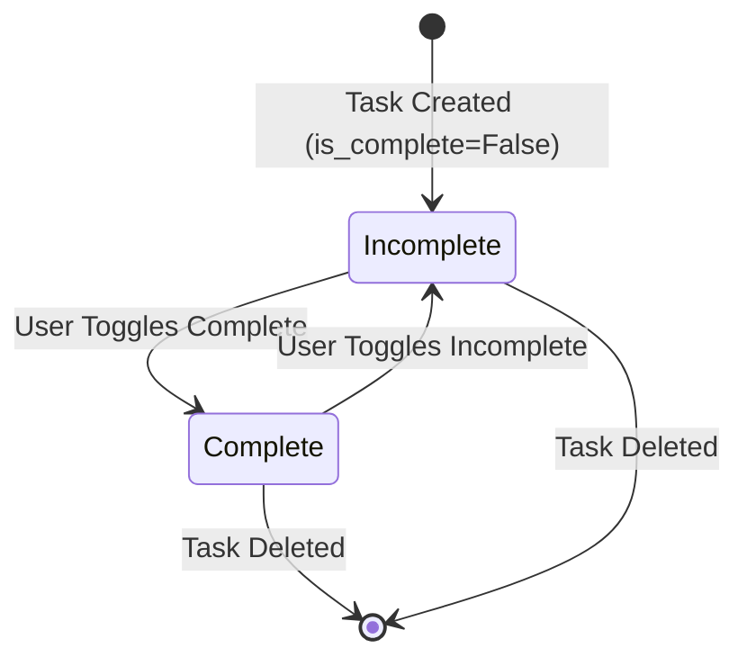

# Data Model: Task CRUD

**Feature**: 001-task-crud
**Date**: 2025-12-31
**Purpose**: Define Task entity structure, relationships, and validation rules

## Task Entity

### SQLModel Definition

```python
# backend/src/models/task.py
from typing import Optional
from sqlmodel import Field, SQLModel
from datetime import datetime


class TaskBase(SQLModel):
    """Base Task model with shared fields"""
    title: str = Field(index=True, max_length=200, description="Task title (required)")
    description: Optional[str] = Field(default=None, description="Task description (optional)")


class TaskCreate(TaskBase):
    """Request model for creating a task"""
    pass  # Inherits title (required) and description (optional)


class TaskUpdate(SQLModel):
    """Request model for updating a task"""
    title: Optional[str] = Field(default=None, max_length=200, description="Task title")
    description: Optional[str] = Field(default=None, description="Task description")


class Task(TaskBase, table=True):
    """Database table model for Task"""
    id: Optional[int] = Field(default=None, primary_key=True)
    user_id: str = Field(foreign_key="users.id", index=True, description="ID of user who owns this task")
    is_complete: bool = Field(default=False, description="Task completion status")
    created_at: datetime = Field(default_factory=datetime.utcnow, description="Timestamp when task was created")
    updated_at: datetime = Field(default_factory=datetime.utcnow, description="Timestamp when task was last updated")

    __tablename__ = "tasks"


class TaskRead(TaskBase):
    """Response model for reading a task (excludes internal fields)"""
    id: int
    user_id: str
    is_complete: bool
    created_at: datetime
    updated_at: datetime
```

### Field Descriptions

| Field | Type | Constraints | Description |
|-------|------|-------------|-------------|
| `id` | int | Primary key, auto-increment | Unique identifier for task |
| `user_id` | str | Foreign key to users table, indexed, NOT NULL | Owner of the task (from JWT) |
| `title` | str | Required, max 200 chars, indexed | Task title provided by user |
| `description` | str | Optional, max length from DB | Task description (null allowed) |
| `is_complete` | bool | Default: False, NOT NULL | Task completion status |
| `created_at` | datetime | Default: utcnow(), NOT NULL | Timestamp when task was created |
| `updated_at` | datetime | Default: utcnow(), NOT NULL | Timestamp when task was last updated |

### Validation Rules

| Rule | Description | Enforcement |
|------|-------------|---------------|
| `title` is required | Cannot create task without title | SQLModel `Field(..., nullable=False)` |
| `title` max 200 chars | Enforce title length limit | SQLModel `Field(max_length=200)` |
| `user_id` is required | Every task must have an owner | SQLModel `Field(foreign_key="users.id")` |
| `user_id` is immutable | Task cannot change owners | Repository enforces on update/delete |
| `is_complete` defaults to False | New tasks start incomplete | SQLModel `Field(default=False)` |

### Database Constraints

```sql
-- Database table schema (generated by SQLModel)
CREATE TABLE tasks (
    id SERIAL PRIMARY KEY,
    user_id VARCHAR(255) NOT NULL,
    title VARCHAR(200) NOT NULL,
    description TEXT,
    is_complete BOOLEAN DEFAULT FALSE,
    created_at TIMESTAMP NOT NULL DEFAULT CURRENT_TIMESTAMP,
    updated_at TIMESTAMP NOT NULL DEFAULT CURRENT_TIMESTAMP,
    FOREIGN KEY (user_id) REFERENCES users(id) ON DELETE CASCADE
);

-- Indexes for performance
CREATE INDEX idx_tasks_user_id ON tasks(user_id);
CREATE INDEX idx_tasks_created_at ON tasks(created_at);
```

## Relationships

### Task → User (Many-to-One)

**Description**: Each task belongs to exactly one user. Each user can have many tasks.

**Cardinality**: `N:1` (Many Tasks to One User)

**Foreign Key**: `task.user_id → users.id`

**Cascade Behavior**: `ON DELETE CASCADE` (if user is deleted, all their tasks are deleted)

**Repository Access**:
```python
# Repository ALWAYS filters by user_id
def get_by_user(self, user_id: str) -> List[Task]:
    """Returns all tasks belonging to specified user"""
    return session.exec(select(Task).where(Task.user_id == user_id)).all()
```

## State Transitions

### Task Completion State Machine



**Transition Rules**:
- Task starts as `is_complete = False` (incomplete)
- User can toggle `is_complete` between `True` and `False`
- Deleted task is removed from database (no soft delete)

## Query Patterns

### Create Task

```python
INSERT INTO tasks (user_id, title, description, is_complete, created_at, updated_at)
VALUES (?, ?, ?, FALSE, NOW(), NOW());
```

**User_id Enforcement**: Always extracted from JWT, never from request body.

---

### Read User's Tasks

```python
SELECT * FROM tasks WHERE user_id = ? ORDER BY created_at DESC;
```

**User_id Enforcement**: Filter by `user_id` WHERE clause (critical for multi-user isolation).

---

### Update Task

```python
UPDATE tasks
SET title = ?, description = ?, updated_at = NOW()
WHERE id = ? AND user_id = ?;
```

**User_id Enforcement**: Validate `user_id` in WHERE clause to prevent cross-user updates.

---

### Delete Task

```python
DELETE FROM tasks WHERE id = ? AND user_id = ?;
```

**User_id Enforcement**: Validate `user_id` in WHERE clause to prevent cross-user deletion.

---

### Toggle Completion

```python
UPDATE tasks
SET is_complete = NOT is_complete, updated_at = NOW()
WHERE id = ? AND user_id = ?;
```

**User_id Enforcement**: Validate `user_id` in WHERE clause to prevent cross-user toggles.

## TypeScript Interfaces (Frontend)

```typescript
// contracts/types.ts - Auto-generated from SQLModel
export interface Task {
  id: number;
  user_id: string;
  title: string;
  description: string | null;
  is_complete: boolean;
  created_at: string;  // ISO 8601 datetime string
  updated_at: string;  // ISO 8601 datetime string
}

export interface TaskCreate {
  title: string;       // Required, max 200 chars
  description?: string;  // Optional
}

export interface TaskUpdate {
  title?: string;       // Optional, max 200 chars if provided
  description?: string;  // Optional
}
```

## Migration Strategy

### Initial Migration (v1.0.0)

```python
# Alembic migration (generated by SQLModel)
def upgrade() -> None:
    op.create_table(
        'tasks',
        sa.Column('id', sa.Integer(), primary_key=True, autoincrement=True),
        sa.Column('user_id', sa.String(255), nullable=False, index=True),
        sa.Column('title', sa.String(200), nullable=False, index=True),
        sa.Column('description', sa.Text(), nullable=True),
        sa.Column('is_complete', sa.Boolean(), default=False, nullable=False),
        sa.Column('created_at', sa.DateTime(), server_default=sa.text('CURRENT_TIMESTAMP'), nullable=False),
        sa.Column('updated_at', sa.DateTime(), server_default=sa.text('CURRENT_TIMESTAMP'), nullable=False),
        sa.ForeignKeyConstraint(['user_id'], ['users.id'], ondelete='CASCADE')
    )
    op.create_index('idx_tasks_user_id', 'tasks', ['user_id'])
    op.create_index('idx_tasks_created_at', 'tasks', ['created_at'])
```

### Future Migrations

**Adding fields**:
```sql
ALTER TABLE tasks ADD COLUMN priority VARCHAR(50) DEFAULT 'medium';
```

**Modifying constraints**:
```sql
ALTER TABLE tasks ALTER COLUMN title TYPE VARCHAR(300);
```

**Adding indexes**:
```sql
CREATE INDEX idx_tasks_is_complete ON tasks(is_complete);
```

## Testing Strategy

### Repository Tests

```python
# backend/tests/test_task_repository.py
def test_get_by_user_returns_only_users_tasks(session):
    user1_id = "user-1"
    user2_id = "user-2"

    # Create tasks for user1
    task1 = Task(title="User1 Task", user_id=user1_id)
    task2 = Task(title="Another User1 Task", user_id=user1_id)

    # Create task for user2
    task3 = Task(title="User2 Task", user_id=user2_id)

    session.add_all([task1, task2, task3])
    session.commit()

    # Verify repository filters by user_id
    repo = TaskRepository(session)
    user1_tasks = repo.get_by_user(user1_id)
    assert len(user1_tasks) == 2
    assert all(t.user_id == user1_id for t in user1_tasks)

    user2_tasks = repo.get_by_user(user2_id)
    assert len(user2_tasks) == 1
    assert user2_tasks[0].user_id == user2_id
```

### Constraint Tests

```python
def test_title_required(session, user_id):
    """Cannot create task without title"""
    with pytest.raises(ValidationError):
        TaskCreate(title="", user_id=user_id)

def test_title_max_length(session, user_id):
    """Cannot create task with title > 200 chars"""
    with pytest.raises(ValidationError):
        TaskCreate(title="x" * 201, user_id=user_id)

def test_user_id_foreign_key(session):
    """Cannot create task with non-existent user_id"""
    with pytest.raises(IntegrityError):
        task = Task(title="Orphan Task", user_id="non-existent-user")
        session.add(task)
        session.commit()
```

## Summary

**Entity**: Task with 7 fields (id, user_id, title, description, is_complete, created_at, updated_at)

**Key Constraints**:
- `user_id` foreign key enforces ownership
- `title` required, max 200 chars
- `is_complete` defaults to False
- Database indexes on `user_id` and `created_at` for performance

**Multi-User Isolation**: ALL repository queries filter by `user_id` WHERE clause (constitution requirement)

**Next Steps**:
1. Generate contracts/ (API specifications and TypeScript types)
2. Create quickstart.md for onboarding
3. Proceed to /sp.tasks to generate implementation tasks
